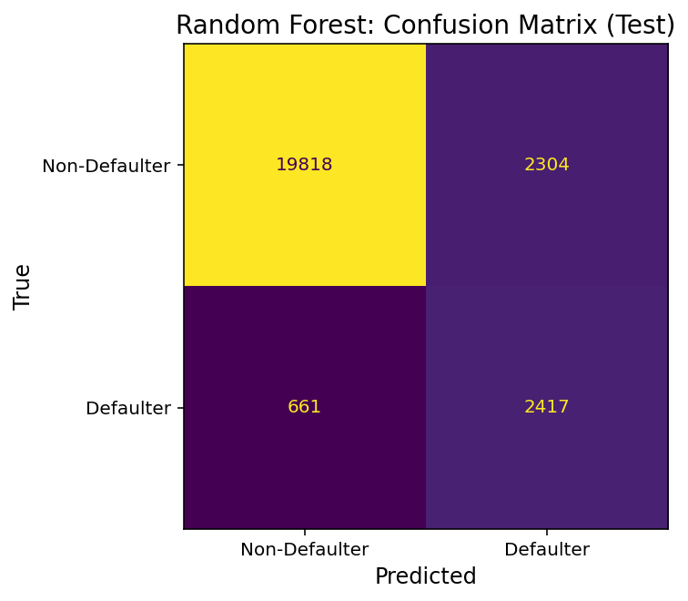
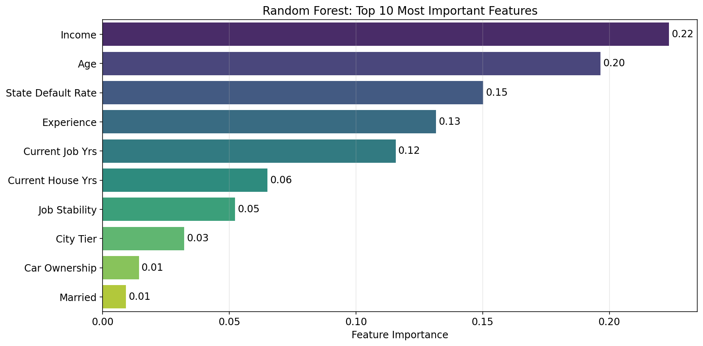

---
language:
  - en
license: apache-2.0
library_name: scikit-learn
model_type: RandomForestClassifier
pipeline_tag: tabular-classification
tags:
  - finance
  - credit-risk
  - loan-default
  - tabular-data
  - random-forest
  - joblib
metrics:
  - auc_pr
  - recall
  - precision
  - f1
---

  

# 🏦 Loan Default Prediction Pipeline
This model repository contains a `scikit-learn` pipeline for predicting loan defaults from customer application data. The pipeline includes all data preprocessing steps and a Random Forest Classifier model trained on 252,000 loan applications. It is designed to assist financial institutions in making more informed, data-driven lending decisions and managing credit risk. 

## Model Details
### Model Description
The pipeline takes raw loan application data as input (formatted as a `pandas DataFrame`) and performs all necessary preprocessing steps such as feature engineering, scaling, and encoding. The pipeline then uses a Random Forest Classifier model to predict the probability of loan default (as a `NumPy array`). 

| Pipeline | Version | Framework | Task | Input | Output | Author | License |
|---------------|---------|-----------|------|-------|--------|--------|---------|
| Random Forest model with preprocessing | 1.0 | Python, scikit-learn | Binary classification | Tabular data | Predicted probabilities | Jens Bender | Apache 2.0 |

### Model Sources
| Component | Description | Link |
|------------|--------------|------|
| **Source Code** | Full project repository with training, evaluation, and deployment scripts | [GitHub](https://github.com/JensBender/loan-default-prediction) |
| **Model Pipeline** | Pre-trained `scikit-learn` pipeline with Random Forest Classifier and preprocessing | [Hugging Face Hub](https://huggingface.co/JensBender/loan-default-prediction-pipeline) |
| **Web App** | Live, interactive demo with Gradio frontend and FastAPI backend | [Hugging Face Spaces](https://huggingface.co/spaces/JensBender/loan-default-prediction-app) |

### How to Get Started with the Model
#### Using the Web App
The model pipeline is deployed as a web application on [Hugging Face Spaces](https://huggingface.co/spaces/JensBender/loan-default-prediction-app). You can interact with the model directly through the web interface without any installation or coding required.

#### Using the API
You can also send requests directly to the FastAPI backend of the Hugging Face Space. This programmatic access is useful for integrating the model into other applications or systems.

Example API usage with Python's `requests` library:

```python
import requests 

# Create example applicant data (JSON payload)
applicant_data = {
    "income": 300000,
    "age": 30,
    "experience": 3,
    "married": "single",
    "house_ownership": "rented",
    "car_ownership": "no",
    "profession": "artist",
    "city": "sikar",
    "state": "rajasthan",
    "current_job_yrs": 3,
    "current_house_yrs": 11,
}

# API request to FastAPI predict endpoint on Hugging Face Spaces
prediction_api_url = "https://jensbender-loan-default-prediction-app.hf.space/api/predict"
response = requests.post(prediction_api_url, json=applicant_data)

# Check if request was successful
response.raise_for_status()

# Extract prediction and probability of default
prediction_response = response.json()
prediction_result = prediction_response["results"][0]
prediction = prediction_result["prediction"]
default_probability = prediction_result["probabilities"]["Default"]

# Show results
print(f"Probability of default: {default_probability * 100:.1f}% (threshold: 29.0%)")
print(f"Prediction: {prediction}")
```

#### Downloading and Using the Pipeline
You can download the serialized `joblib` pipeline for inference using `huggingface_hub`.  
**Note:** Unlike the API, the pipeline requires a `pandas DataFrame` input and returns probabilities. You must manually apply the optimized decision threshold of `0.29`.

```python
from huggingface_hub import hf_hub_download
import joblib
import pandas as pd

# Download the pipeline from Hugging Face Hub and load it into memory
pipeline_path = hf_hub_download(
  "JensBender/loan-default-prediction-pipeline",
  "loan_default_rf_pipeline.joblib"
)
pipeline = joblib.load(pipeline_path)

# Create a sample DataFrame
# Note: The column names and data types must match the training data
applicant_data = pd.DataFrame({
    "income": [300000],
    "age": [30],
    "experience": [3],
    "married": ["single"],
    "house_ownership": ["rented"],
    "car_ownership": ["no"],
    "profession": ["Artist"],
    "city": ["Sikar"],
    "state": ["Rajasthan"],
    "current_job_yrs": [3],
    "current_house_yrs": [11],
})

# Get predicted probabilities 
probabilities = pipeline.predict_proba(applicant_data)  # np.ndarray containing both classes (0: no default, 1: default)
default_probability = probabilities[0, 1]  # row 0, column 1 

# Apply optimized threshold to make a classification decision
threshold = 0.29
prediction = "Default" if default_probability >= threshold else "No Default"

# Show results
print(f"Probability of default: {default_probability * 100:.1f}% (threshold: 29.0%)")
print(f"Prediction: {prediction}")
```

---

## Uses
### Direct Use
The model is intended to be used as a tool to support credit risk assessment. It can be integrated into decision-making workflows to provide a quantitative measure of default risk for loan applicants.

### Out-of-Scope Use
This model is **not** intended for:
- Fully automated lending decisions without human oversight. The model's predictions should not be the sole factor in any financial decision.
- Evaluating applicants from demographic, geographic, or socioeconomic backgrounds not represented in the training data.
- Use in a production environment without rigorous, ongoing validation and fairness audits. 

---

## Bias, Risks, and Limitations
The model was trained on historical data that may carry biases related to socioeconomic status, geography, or other demographic factors, potentially leading to unfair predictions for certain groups. The model can be overconfident on misclassified edge cases, assigning high probabilities to incorrect predictions. Confidence scores should not be relied upon without additional scrutiny.

### Recommendations
- **Human in the Loop:** Always use this model as part of a broader decision-making framework that includes human oversight.
- **Fairness and Bias Audits:** Before deploying this model in a production environment, conduct thorough fairness and bias analyses to ensure it performs equally across different demographic groups.
- **Model Monitoring:** Continuously monitor the model's performance and predictions to detect and mitigate any performance degradation or emerging biases.

---

## Training Details
### Training Data
The model was trained on the "Loan Prediction Based on Customer Behavior" dataset by Subham Jain, available on [Kaggle](https://www.kaggle.com/datasets/subhamjain/loan-prediction-based-on-customer-behavior). The dataset contains information provided by customers of a financial institution during the loan application process. 

Dataset Statistics:
- Dataset size: 252,000 records 
- Target variable: Risk flag (12.3% defaults)
- Features: 11 
  - Demographic: Age, married, profession
  - Financial: Income, house ownership, car ownership
  - Location: City, state
  - Behavioral: Experience, current job years, current house years

### Training Procedure
#### Preprocessing
The preprocessing of the raw data includes the following steps:
- Handled duplicates, data types, missing values, and outliers and standardized column names.
- Engineered new features:
  - Job Stability: Derived from the applicant's profession.
  - City Tier: Derived from the applicant's city.
  - State Default Rate: Derived from the historical default rate of the applicant's state (target encoding).
- Scaled numerical features using `StandardScaler`.
- Encoded categorical features using `OneHotEncoder` (nominal) and `OrdinalEncoder` (ordinal).

#### Training Hyperparameters
The final Random Forest Classifier model was trained with the following hyperparameters, identified through randomized search with 5-fold cross-validation:
- `n_estimators=225`  
- `max_depth=26`  
- `min_samples_split=2`  
- `min_samples_leaf=1`  
- `max_features=0.13`  
- `class_weight='balanced'` 

---

## Evaluation
### Testing Data, Factors & Metrics
#### Testing Data
The model was evaluated on a hold-out test set comprising 10% of the dataset (25,200 samples), which was not used during training or hyperparameter tuning.

#### Factors
The model's performance was evaluated across the entire dataset.

#### Metrics
The primary evaluation metric was the **Area Under the Precision-Recall Curve (AUC-PR)**, which is well-suited for imbalanced datasets where the focus is on the minority class (default). Secondary metrics included **Precision**, **Recall**, and **F1-Score** for the positive class (default). The decision threshold was optimized to maximize the F1-score while ensuring a minimum recall of 0.75 and a minimum precision of 0.50.

### Results
The final Random Forest model achieved an **AUC-PR of 0.59** on the test set.

#### Performance on Train, Validation, and Test Sets
The model's performance was consistent across the validation and test sets, indicating good generalization to unseen data.

| Data             | AUC-PR | Recall (Class 1)   | Precision (Class 1) | F1-Score (Class 1) | Accuracy |
|:-----------------|:-------|:-------------------|:--------------------|:-------------------|:---------|
| Training (80%)   | 0.68   | 1.00               | 0.62                | 0.77               | 0.93     |
| Validation (10%) | 0.62   | 0.80               | 0.54                | 0.64               | 0.89     |
| Test (10%)       | 0.59   | 0.79               | 0.51                | 0.62               | 0.88     |

#### Classification Report (Test)
|                        | Precision | Recall | F1-Score | Samples |
|:-----------------------|:----------|:-------|:---------|:--------|
| Class 0: Non-Defaulter | 0.97      | 0.90   | 0.93     | 22,122  |
| Class 1: Defaulter     | 0.51      | 0.79   | 0.62     | 3,078   |
| Accuracy               |           |        | 0.88     | 25,200  |
| Macro Avg              | 0.74      | 0.84   | 0.78     | 25,200  |
| Weighted Avg           | 0.91      | 0.88   | 0.89     | 25,200  |



#### Feature Importance
The most influential features in the model's predictions are income, age, and the engineered state default rate.


---

## Environmental Impact
Carbon emissions were not measured for the training of this model.

---

## Technical Specifications
### Model Architecture and Objective
The model is a `scikit-learn` pipeline that includes both preprocessing and a `RandomForestClassifier`. The objective is binary classification to predict whether a loan applicant will default.

### Compute Infrastructure
#### Hardware
Trained on a local machine: Intel Pentium Gold 7505 @ 2.00GHz (2 cores, 4 logical processors), Windows 10.
#### Software
Python 3.10 with `scikit-learn` (1.6.0) and `pandas` (2.2.3). The pipeline is loaded using `joblib` (1.4.2).

---

## License
The model pipeline is licensed under [Apache-2.0](LICENSE). The source code of this project, hosted on [GitHub](https://github.com/JensBender/loan-default-prediction), and the source code of the web app hosted on [Hugging Face Spaces](https://huggingface.co/spaces/JensBender/loan-default-prediction-app), are licensed under the MIT License. 

---

## Citation
If you use this model in your work, please cite it as follows:
```bibtex
@misc{bender_loan_default_prediction_2025,
  author       = {Bender, Jens},
  title        = {Loan Default Prediction Pipeline},
  year         = {2025},
  publisher    = {Hugging Face},
  url          = {https://huggingface.co/JensBender/loan-default-prediction-pipeline},
  note         = {Version 1.0. A scikit-learn Random Forest pipeline for predicting loan defaults. Trained on 252,000 loan applications. Source code available at \url{https://github.com/JensBender/loan-default-prediction}. Licensed under Apache-2.0.}
}
```

---

## Model Card Contact
For questions or feedback about the model, please contact Jens Bender on [GitHub](https://github.com/JensBender) or [Hugging Face](https://huggingface.co/JensBender).
