<!-- anchor tag for back-to-top links -->
<a name="readme-top"></a>

<!-- HEADER IMAGE  -->


<!-- SHORT SUMMARY  -->
Developed a machine learning pipeline for loan default prediction to support credit risk assessment. Engineered, scaled, and encoded features. Trained, tuned, and evaluated eight models. Deployed a Random Forest Classifier with an optimized decision threshold (AUC-PR: 0.59, recall: 0.79 for defaulters) as a Dockerized web app with a FastAPI backend and Gradio frontend, hosted on Hugging Face Spaces.

---

<!-- TABLE OF CONTENTS -->
## 📋 Table of Contents
<ol>
  <li>
    <a href="#-summary">Summary</a>
    <ul>
      <li><a href="#️-built-with">Built With</a></li>
    </ul>
  </li>
  <li>
    <a href="#-motivation">Motivation</a>
  </li>
  <li>
    <a href="#️-data">Data</a>
  </li>
  <li>
    <a href="#-data-preprocessing">Data Preprocessing</a>
  </li>
  <li>
    <a href="#-exploratory-data-analysis-eda">Exploratory Data Analysis (EDA)</a>
  </li>
  <li>
    <a href="#️-modeling">Modeling</a>
    <ul>
      <li><a href="#-baseline-models">Baseline Models</a></li>      
      <li><a href="#️-hyperparameter-tuning">Hyperparameter Tuning</a></li>
      <li><a href="#-final-model">Final Model</a></li>
    </ul>
  </li>
  <li>
    <a href="#-deployment">Deployment</a>
  </li>
  <li>
    <a href="#-testing">Testing</a>
  </li>
  <li>
    <a href="#️-getting-started">Getting Started</a>
  </li>
  <li>
    <a href="#️-usage">Usage</a>
    <ul>
      <li><a href="#web-app">Web App</a></li>      
      <li><a href="#api">API</a></li>
      <li><a href="#model-pipeline">Model Pipeline</a></li>
    </ul>
  </li>
  <li>
    <a href="#️-responsible-use">Responsible Use</a>
  </li>
  <li>
    <a href="#-project-structure">Project Structure</a>
  </li>
  <li>
    <a href="#️-license">License</a>
  </li>
  <li>
    <a href="#-credits">Credits</a>
  </li>
  <li>
    <a href="#-appendix">Appendix</a>
    <ul>
      <li><a href="#descriptive-statistics-for-numerical-columns">Descriptive Statistics for Numerical Columns</a></li>      
      <li><a href="#numerical-distributions-histograms">Numerical Distributions (Histograms)</a></li>      
      <li><a href="#categorical-frequencies-bar-plots">Categorical Frequencies (Bar Plots)</a></li>      
      <li><a href="#numerical-numerical-relationships-scatter-plots">Numerical-Numerical Relationships (Scatter Plots)</a></li>      
      <li><a href="#numerical-categorical-relationships-bar-plots">Numerical-Categorical Relationships (Bar Plots)</a></li> 
      <li><a href="#categorical-categorical-relationships-grouped-bar-plots">Categorical-Categorical Relationships (Grouped Bar Plots)</a></li> 
      <li><a href="#model-comparison-tables">Model Comparison Tables</a></li>      
      <li><a href="#model-threshold-optimization">Model Threshold Optimization</a></li>
    </ul>
  </li>
</ol>


<!-- SUMMARY -->
## 🎯 Summary
Built an end-to-end machine learning solution for predicting loan defaults using customer application data, enabling financial institutions to make data-driven lending decisions and better manage credit risk. The project includes:
- **Data Preprocessing**: Engineered new features (e.g., job stability, city tier, state default rate), handled duplicates, data types, missing values, and outliers, scaled numerical features, and encoded categorical features.
- **Exploratory Data Analysis**: Analyzed distributions and relationships using descriptive statistics, correlations, and visualizations.
- **Modeling**: Trained and evaluated eight baseline models (e.g., Logistic Regression, Random Forest, XGBoost) and tuned hyperparameters. Selected a Random Forest Classifier with an optimized decision threshold, achieving an AUC-PR of 0.59, recall of 0.79, and precision of 0.51 for the default class on the hold-out test set. Visualized feature importances and showed model prediction examples.
- **Deployment**: Served the full machine learning pipeline (preprocessing and model) as a web app using a FastAPI backend and Gradio frontend within a single Docker container, hosted on Hugging Face Spaces.
- **Testing**: Implemented comprehensive unit, integration, and end-to-end tests to validate individual components, their interactions, and entire user journeys.

**Model Pipeline:** [Hugging Face Hub](https://huggingface.co/JensBender/loan-default-prediction-pipeline)  
**Web App:** [Hugging Face Spaces](https://huggingface.co/spaces/JensBender/loan-default-prediction-app)

### 🛠️ Built With
- [![Python][Python-badge]][Python-url]
- [![Pandas][Pandas-badge]][Pandas-url]
- [![Matplotlib][Matplotlib-badge]][Matplotlib-url] 
- [![Seaborn][Seaborn-badge]][Seaborn-url]
- [![scikit-learn][scikit-learn-badge]][scikit-learn-url]
- [![FastAPI][FastAPI-badge]][FastAPI-url]
- [![Pydantic][Pydantic-badge]][Pydantic-url]
- [![Gradio][Gradio-badge]][Gradio-url]
- [![Docker][Docker-badge]][Docker-url]
- [![pytest][pytest-badge]][pytest-url]
- [![Selenium][Selenium-badge]][Selenium-url]
- [![Hugging Face][HuggingFace-badge]][HuggingFace-url]
- [![VS Code][VSCode-badge]][VSCode-url]
- [![Jupyter Notebook][JupyterNotebook-badge]][JupyterNotebook-url]

<p align="right">(<a href="#readme-top">back to top</a>)</p>


<!-- MOTIVATION -->
## 💡 Motivation
**Problem**  
Predicting loan defaults is a challenging task due to the multitude of influencing factors such as customers' demographic, financial, location, and behavioral attributes. Traditional default prediction models often oversimplify complex relationships between customer features and default risk. Machine learning offers enhanced predictive capability by capturing non-linear patterns and intricate dependencies in loan application data, enabling more accurate predictions of loan default risk.

**Objectives**  
- Develop a machine learning model to predict loan defaults using customer data from loan applications.
- Compare multiple models (e.g., Logistic Regression, Random Forest, XGBoost).
  - Primary evaluation metric: Area Under the Precision-Recall Curve (AUC-PR), as it suits class imbalance (12.3% defaults) with a focus on preventing defaults.
  - Secondary evaluation metrics: Class-1-specific recall, precision, and F1-score.
  - Success criteria: Minimum class-1 recall of 0.75 and class-1 precision of 0.50 on the test data.
- Identify key factors influencing loan default risk through feature importance analysis.
- Deploy the model and preprocessing pipeline as a Dockerized app with FastAPI backend and Gradio frontend.
- Implement robust testing (unit, integration, and end-to-end) for the machine learning pipeline, backend, and frontend.

**Value Proposition**  
This project provides a blueprint for how a financial institution can leverage machine learning to build a support tool for credit risk assessment, leading to better and faster lending decisions.

**Potential Impact**  
- Reduced Financial Loss: Aims to decrease the loan default rate, preventing losses from defaulted loans.
- Increased Efficiency: Streamlines risk assessment to cut loan processing time.
- Actionable Insights: Identifies key risk drivers through feature importance analysis, making the decision process more data-driven.

<p align="right">(<a href="#readme-top">back to top</a>)</p>


<!-- DATA -->
## 🗂️ Data
The dataset contains information provided by customers of a financial institution during the loan application process. It is sourced from the "Loan Prediction Based on Customer Behavior" dataset by Subham Jain, available on [Kaggle](https://www.kaggle.com/datasets/subhamjain/loan-prediction-based-on-customer-behavior). Stored in `Training Data.csv`, it contains the features, target variable (`Risk Flag`), and `ID` column. 

Dataset Statistics:
- Dataset size: 252,000 records 
- Target variable: Risk flag (12.3% defaults)
- Features: 11 
  - Demographic: Age, married, profession
  - Financial: Income, house ownership, car ownership
  - Location: City, state
  - Behavioral: Experience, current job years, current house years

Data Overview Table:

| Column | Description | Storage Type | Semantic Type | Theoretical Range | Observed Range |
| :--- | :--- | :--- | :--- | :--- | :--- |
| Risk Flag | Defaulted on loan (0: No, 1: Yes) | Integer | Categorical (Binary) | [0, 1] | [0, 1] |
| Income | Income of the applicant | Integer | Numerical | [0, ∞] | [10K, 10M] |
| Age | Age of the applicant (in years) | Integer | Numerical | [18, ∞] | [21, 79] |
| Experience | Work experience (in years) | Integer | Numerical | [0, ∞] | [0, 20] |
| Profession | Applicant's profession | String | Categorical (Nominal) | Any profession [e.g., "Architect", "Dentist"] | 51 unique professions |
| Married | Marital status | String | Categorical (Binary) | ["single", "married"] | ["single", "married"] |
| House Ownership | Applicant owns or rents a house | String | Categorical (Nominal) | ["rented", "owned", "norent_noown"] | ["rented", "owned", "norent_noown"] |
| Car Ownership | Whether applicant owns a car | String | Categorical (Binary) | ["yes", "no"] | ["yes", "no"] |
| Current Job Years | Years in the current job | Integer | Numerical | [0, ∞] | [0, 14] |
| Current House Years | Years in the current house | Integer | Numerical | [0, ∞] | [10, 14] |
| City | City of residence | String | Categorical (Nominal) | Any city [e.g., "Mumbai", "Bangalore"] | 317 unique cities |
| State | State of residence | String | Categorical (Nominal) | Any state [e.g., "Maharashtra", "Tamil_Nadu"] | 29 unique states |

Example Data:

| Risk Flag | Income    | Age | Experience | Profession         | Married | House Ownership | Car Ownership | Current Job Years | Current House Years | City      | State         |
| :-------- | :-------- | :-- | :--------- | :----------------- | :------ | :-------------- | :------------ | :---------------- | :------------------ | :-------- | :------------ |
| 0         | 1,303,834 | 23  | 3          | Mechanical_engineer | single  | rented          | no            | 3                 | 13                   | Rewa      | Madhya_Pradesh |
| 1         | 6,256,451 | 41  | 2          | Software_Developer | single  | rented          | yes           | 2                 | 12                   | Bangalore | Tamil_Nadu    |
| 0         | 3,991,815 | 66  | 4          | Technical_writer   | married | rented          | no            | 4                 | 10                   | Alappuzha | Kerala        |

<p align="right">(<a href="#readme-top">back to top</a>)</p>


<!-- DATA PREPROCESSING -->
## 🧹 Data Preprocessing
Used `pandas` and `sklearn` for data loading, cleaning, transformation, and saving.
- **Loaded data** from .csv file using `pandas` `read_csv`.
- **Standardized column names and labels** to `snake_case` using `pandas` string methods and `apply` with custom functions.
- **Handled duplicates**: Verified the absence of duplicates using both the ID column and complete row comparison.
- **Handled data types**: Converted string columns with two categories to boolean columns using `pandas` `map`.
- **Train-validation-test split**: Split data into training (80%), validation (10%), and test (10%) sets using `sklearn` `train_test_split`.
- **Engineered new features**: Derived job stability from profession and city tier from city using mapping functions with  `pandas` `map`. Derived state default rate from state using target encoding.
- **Defined semantic type** for each column (numerical, categorical, boolean).
- **Handled missing values**: Verified the absence of missing values in all columns and datasets.
- **Handled outliers**: Identified multivariate outliers using `sklearn` `IsolationForest` and univariate outliers using statistical methods (3SD and 1.5 IQR) with custom transformer classes that inherit from `sklearn` `BaseEstimator` and `TransformerMixin`.
- **Feature scaling and encoding**:
    - Scaled numerical features: Used standard scaling with `sklearn` `StandardScaler`.
    - Encoded categorical features: Used one-hot encoding for nominal features (`sklearn` `OneHotEncoder`) and ordinal encoding for ordinal features (`OrdinalEncoder`).
    - Applied scaling and encoding together using `sklearn` `ColumnTransformer`.
- **Saved the preprocessed data** for training, validation, and test sets as .csv files using `pandas` `to_csv`.

<p align="right">(<a href="#readme-top">back to top</a>)</p>


<!-- EXPLORATORY DATA ANALYSIS -->
## 🔍 Exploratory Data Analysis (EDA)
Used `pandas`, `numpy`, `seaborn`, and `matplotlib` for statistical analysis and visualizations.
- **Univariate EDA**:
    - **Numerical columns**:
        - Analyzed [descriptive statistics](#descriptive-statistics-for-numerical-columns) (e.g., mean, median) using `pandas` `describe`.
        - Visualized distributions with [histograms](#numerical-distributions-histograms) using `seaborn` `histplot` and `matplotlib`.
    - **Categorical columns**:
        - Examined frequencies using `pandas` `value_counts`.
        - Visualized frequency distributions with [bar plots](#categorical-frequencies-bar-plots) using `seaborn` `barplot` and `matplotlib`. 
- **Bivariate EDA**:
    - **Numerical vs. numerical**:
        - Analyzed pairwise relationships with a correlation matrix (`pandas` `corr` and `numpy`) and visualized them with a heatmap (`seaborn` `heatmap`), see below.
        - Visualized relationships with [scatterplots](#numerical-numerical-relationships-scatter-plots) using `seaborn` `scatterplot` and `matplotlib`.
    - **Numerical vs. categorical**:
        - Explored relationships with group-wise statistics (e.g., mean or median by category) using `pandas` `groupby` and `agg`.
        - Quantified the magnitude of group differences with Cohen's d using a custom function.
        - Visualized results with [bar plots](#numerical-categorical-relationships-bar-plots) using `seaborn` `barplot` and `matplotlib`.
    - **Categorical vs. categorical**:
        - Analyzed relationships with contingency tables using `pandas` `crosstab`.
        - Visualized relationships with [grouped bar plots](#categorical-categorical-relationships-grouped-bar-plots) using `pandas` `crosstab` `plot` and `matplotlib`.

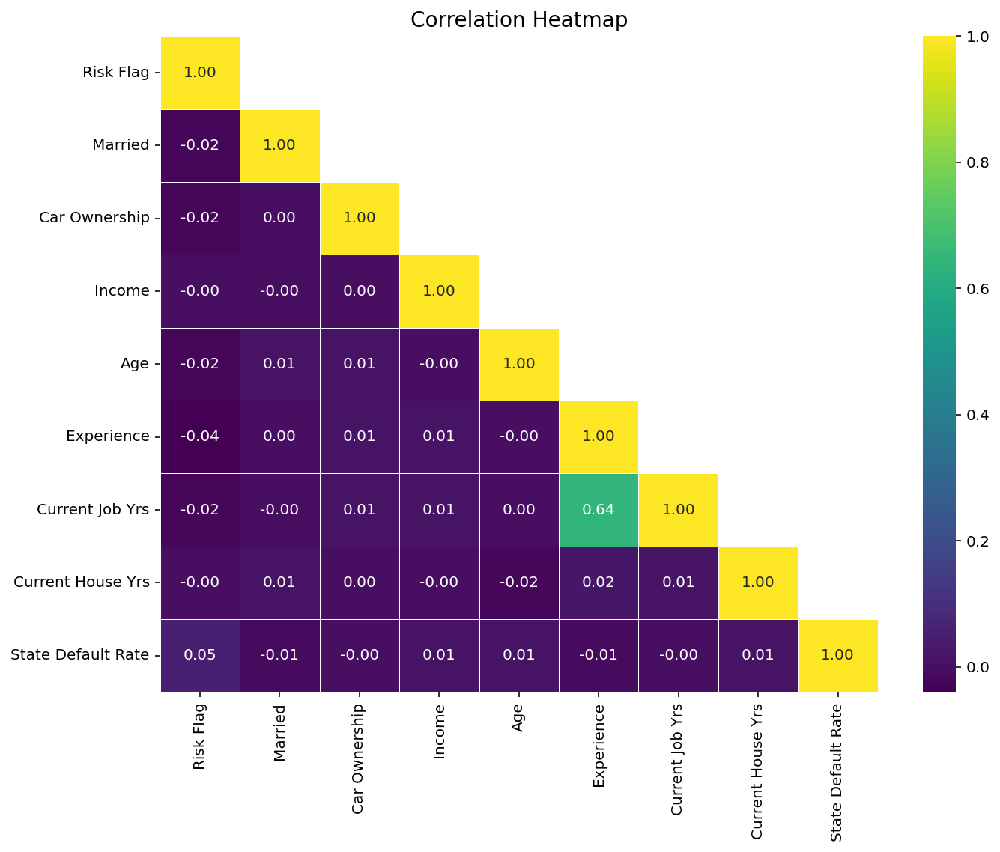

<p align="right">(<a href="#readme-top">back to top</a>)</p>


<!-- Modeling -->
## 🏗️ Modeling
Trained, evaluated, and optimized multiple models using `sklearn` and `xgboost`.

### 🧱 Baseline Models  
- Trained eight baseline models with default hyperparameter values.
- Trained each model with four outlier handling methods. 
- Evaluated model performance using AUC-PR (primary metric) and class-1 recall, precision, and F1-score (secondary metrics). 

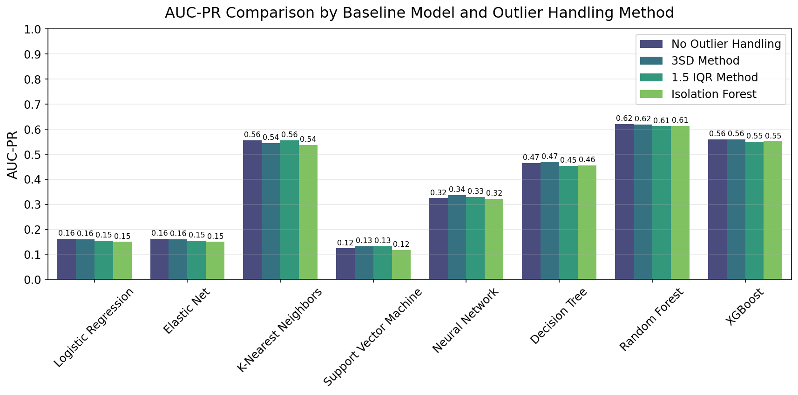
Proceeded without outlier handling, as it did not meaningfully improve AUC-PR. Plotted precision-recall curves using `matplotlib`.

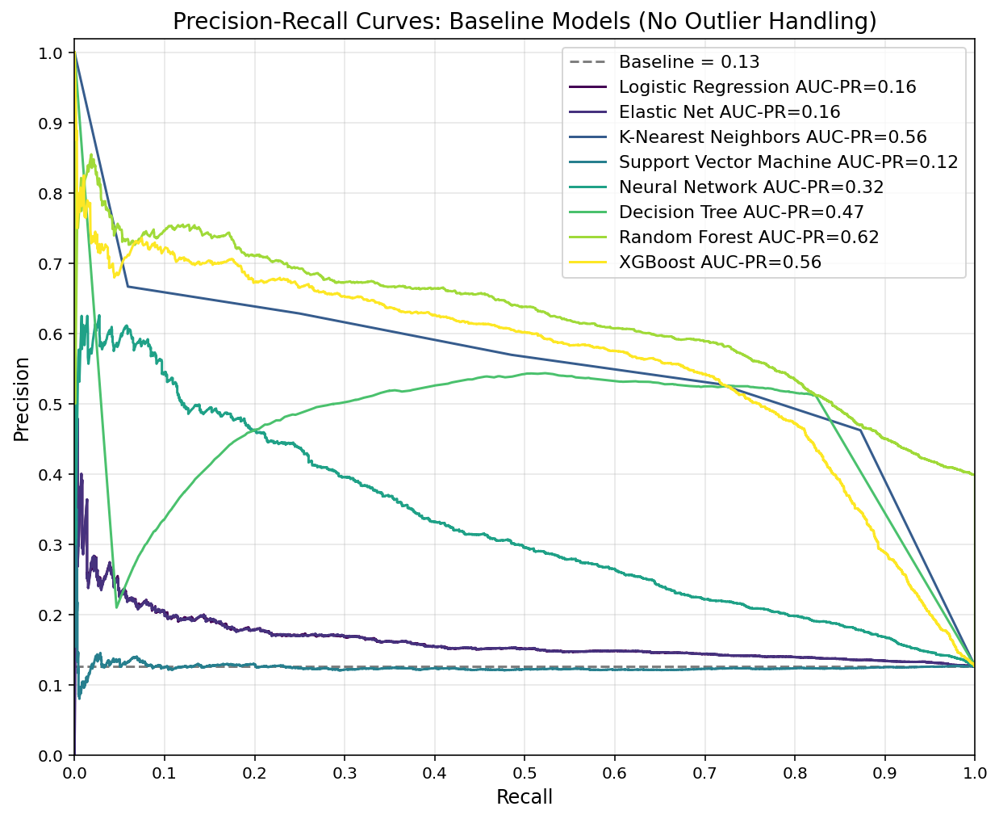
The top-performing models were selected for hyperparameter tuning: Random Forest (AUC-PR: 0.62), XGBoost (0.56), K-Nearest Neighbors (0.56), and Decision Tree (0.47). See detailed metrics in [Appendix: Model Comparison Tables](#model-comparison-tables).

<p align="right">(<a href="#readme-top">back to top</a>)</p>

### 🎛️ Hyperparameter Tuning  
Performed random search with 5-fold cross-validation using `sklearn` `RandomizedSearchCV`. Evaluated the best-performing model from each algorithm using precision-recall curves on the validation data. Random Forest demonstrated the highest AUC-PR (0.62), followed by XGBoost (0.61).  
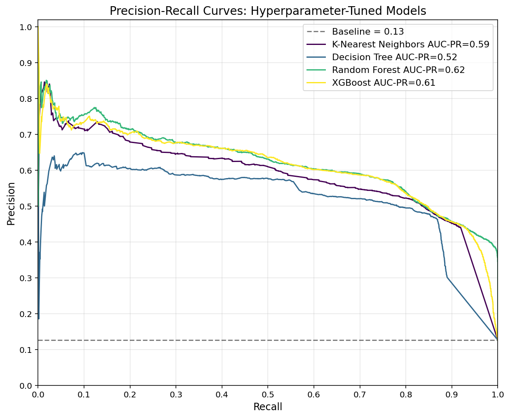

**Threshold Optimization**  
Optimized decision thresholds of all tuned models to balance recall and precision based on business needs. For loan defaults, recall is often prioritized because missing a defaulter (a false negative) is costly. Determined the optimal thresholds by maximizing the F1-score while ensuring recall ≥ 0.80 and precision ≥ 0.40. The plot below shows threshold optimization for Random Forest. For all model plots, see [Appendix: Model Threshold Optimization](#model-threshold-optimization).
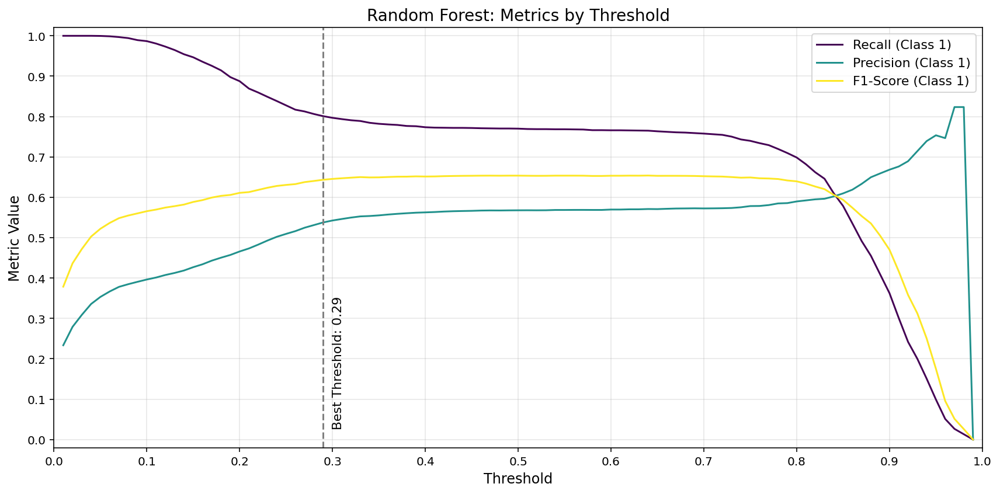

Compared performance of hyperparameter-tuned models with optimized decision thresholds on the validation data. Random Forest and XGBoost demonstrated the highest F1-score (0.64) while meeting minimum recall (0.80) and exceeding precision (0.54 vs. min. 0.40).
| Model               | AUC-PR | Recall (Class 1) | Precision (Class 1) | F1-Score (Class 1) | Accuracy |
|---------------------|--------|------------------|---------------------|-------------------|----------|
| K-Nearest Neighbors | 0.59   | 0.81             | 0.52                | 0.63              | 0.88     |
| Decision Tree       | 0.52   | 0.81             | 0.49                | 0.61              | 0.87     |
| Random Forest       | 0.62   | 0.80             | 0.54                | 0.64              | 0.89     |
| XGBoost             | 0.61   | 0.80             | 0.54                | 0.64              | 0.89     |

Diagnosed overfitting of optimized threshold models by comparing training and validation performance. Random Forest showed the lowest AUC-PR difference (0.06) compared to XGBoost (0.13), Decision Tree (0.13), and KNN (0.26).
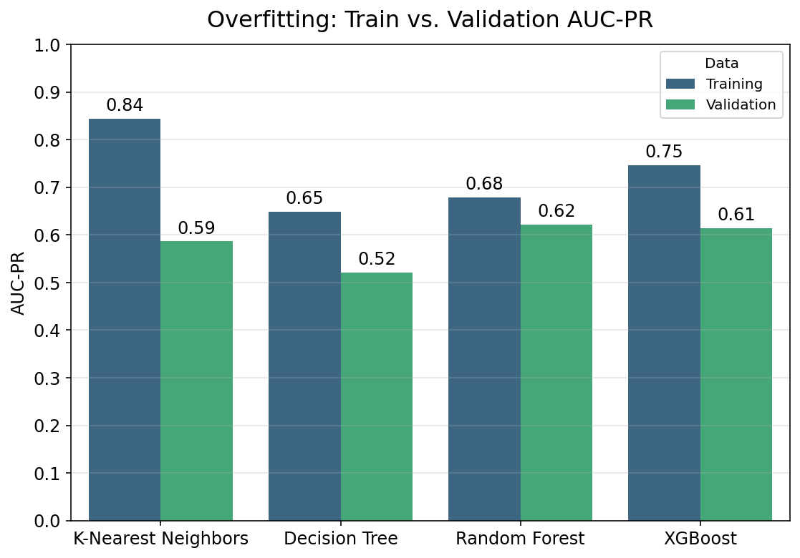

<p align="right">(<a href="#readme-top">back to top</a>)</p>

### 🏆 Final Model
**Model Selection**  
Random Forest with optimized threshold of 0.29 was selected for its good performance, low overfitting, and interpretability.
- Performance: Highest AUC-PR (0.62) and F1-score (0.64, tied with XGBoost), meeting minimum recall and precision.
- Overfitting: Lowest AUC-PR difference between training and validation (0.06).  
- Interpretability: Higher degree of interpretability than XGBoost, crucial for transparency and regulatory compliance in finance.  
- Hyperparameters:
  - `n_estimators=225`
  - `max_depth=26`
  - `min_samples_split=2`
  - `min_samples_leaf=1`
  - `max_features=0.13`
  - `class_weight="balanced"`

**Model Evaluation**  
Compared metrics between training, validation, and test data. The performance drop from validation to test was small, suggesting consistent model behavior on unseen data.
| Data       | AUC-PR | Recall (Class 1) | Precision (Class 1) | F1-Score (Class 1) | Accuracy |
|------------|--------|--------------------|---------------------|--------------------|----------|
| Training   | 0.68   | 1.00               | 0.62                | 0.77               | 0.93     |
| Validation | 0.62   | 0.80               | 0.54                | 0.64               | 0.89     |
| Test       | 0.59   | 0.79               | 0.51                | 0.62               | 0.88     |

Evaluated model performance on the test data using a classification report and a confusion matrix. The model met the project-defined success criteria, achieving recall ≥ 0.75 and precision ≥ 0.50 for defaulters on unseen data.
|                        | Precision | Recall | F1-Score | Samples |
|------------------------|-----------|--------|----------|---------|
| Class 0: Non-Defaulter | 0.97      | 0.90   | 0.93     | 22122   |
| Class 1: Defaulter     | 0.51      | 0.79   | 0.62     | 3078    |
| Accuracy               |           |        | 0.88     | 25200   |
| Macro Avg              | 0.74      | 0.84   | 0.78     | 25200   |
| Weighted Avg           | 0.91      | 0.88   | 0.89     | 25200   |


**Feature Importance**  
The most influential features were income, age, and state default rate, indicating that financial stability and regional risk factors heavily influence loan defaults. Other factors like experience and current job years also contributed moderately, while demographic factors like car ownership and marital status had minimal impact.


**Model Prediction Examples**  
The table below illustrates model performance on test data by highlighting best examples (correct, high confidence), worst examples (incorrect, high confidence), and typical examples (average confidence). The model demonstrated reliable predictions on typical cases but displayed problematic overconfidence on misclassified edge cases.

| Example | Income    | Age | State Default Rate | Experience | Actual Default | Predicted Default | Confidence | Misclassified |
| ------- | --------- | --- | ------------------ | ---------- | -------------- | ----------------- | ---------- | ------------- |
| Best    | 495,619   | 26  | 12.8%              | 1          | Yes            | Yes               | 99%        | ✅ No         |
| Best    | 2,901,323 | 56  | 13.7%              | 2          | No             | No                | 100%       | ✅ No         |
| Worst   | 8,290,834 | 42  | 12.8%              | 3          | Yes            | No                | 95%        | ❌ Yes        |
| Worst   | 7,644,982 | 24  | 12.2%              | 1          | No             | Yes               | 98%        | ❌ Yes        |
| Typical | 4,570,845 | 47  | 15.5%              | 3          | Yes            | Yes               | 94%        | ✅ No         |
| Typical | 8,391,288 | 24  | 11.7%              | 4          | No             | No                | 94%        | ✅ No         |

<p align="right">(<a href="#readme-top">back to top</a>)</p>


<!-- DEPLOYMENT -->
## 🚀 Deployment
Deployed a user-friendly web application to make the model easily accessible. Used `scikit-learn` to built the end-to-end ML pipeline, including all data preprocessing steps and the final Random Forest model. The ML pipeline was then wrapped into a web app using `FastAPI` backend and `Gradio` frontend, containerized with `Docker`, and hosted on Hugging Face.

**FastAPI Backend**  
- Served the ML pipeline via a RESTful API built with `FastAPI`, supporting both single and batch requests.  
- Implemented data validation using `Pydantic` models, including required and optional fields, type constraints, enums for categorical fields, value range constraints for numerical fields, and custom validation logic. 
- The `/predict` endpoint accepts loan application data in JSON format, processes it through the ML pipeline, and returns predictions ("default" or "no default") along with probability scores.

**Gradio Frontend**   
- Built a user-friendly interface with `Gradio` so users can enter applicant information through a simple form.  
- Sends submissions to the FastAPI backend, which returns predictions rendered directly in the UI.

**Docker**  
- Containerized the application combining the `FastAPI` backend and `Gradio` frontend in a single `Docker` container for reliable and portable deployment.  
- The provided `Dockerfile` defines the Python environment, installs dependencies, and launches both backend and frontend with the `start.sh` shell script.

**Hosting on Hugging Face**
- Serialized the ML pipeline using `joblib` and uploaded it to [Hugging Face Hub](https://huggingface.co/JensBender/loan-default-prediction-pipeline) for versioning and reuse.
- Hosted the Dockerized app on [Hugging Face Spaces](https://huggingface.co/spaces/JensBender/loan-default-prediction-app) to offer a live, interactive demo for end users.
- Utilized GitHub Actions for continuous deployment by syncing application-related files from the GitHub repository with the Hugging Face Spaces repository.

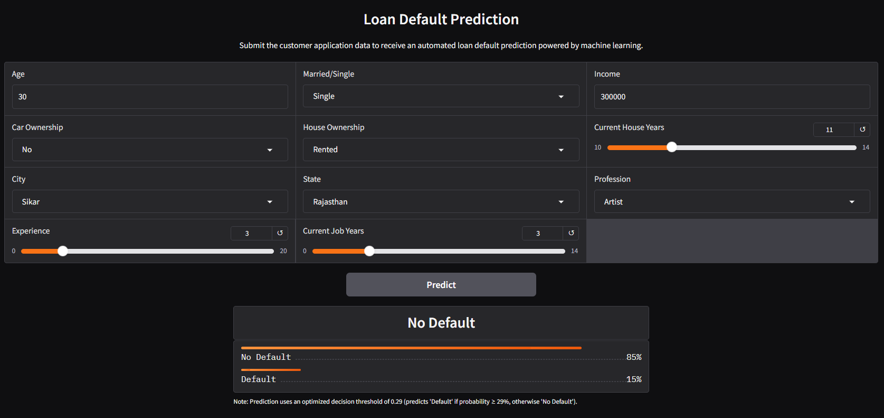

<p align="right">(<a href="#readme-top">back to top</a>)</p>


<!-- TESTING -->
## 🕵 Testing
Developed comprehensive unit, integration, and end-to-end tests using `pytest`.
- **Unit Tests** (`tests/unit/`): Validate individual components in isolation.
  - Custom Transformers: Tested each transformer in `src/custom_transformers.py` to ensure correct data transformation, scikit-learn compatibility, and proper error handling for invalid inputs.
  - Pydantic Schemas: Validated the data models in `backend/schemas.py` to confirm that type constraints, enums, value ranges, and custom validators for API requests and responses work as expected.
  - Helper Functions: Verified that the internal functions in `backend/app.py` (e.g., load pipeline) and `frontend/app.py` (e.g., format input) perform their intended tasks.
- **Integration Tests** (`tests/integration/`): Verify that different components of the application work together.
  - ML Pipeline: Tested the interactions between custom transformers within pipeline segments (e.g., feature engineering, missing value handling) and the complete data preprocessing and model pipeline defined in `src/pipeline.py`.
  - FastAPI Backend: Verified the `/predict` endpoint behavior with single and batch predictions, including input validation, error handling (e.g., HTTP 422, 500), and expected responses for various inputs.
  - Frontend-Backend Integration: Tested the communication between the Gradio frontend and the FastAPI backend to ensure data is sent and received correctly.
- **End-to-End (E2E) Tests** (`tests/e2e/`): Simulate real user journeys.
  - Utilized `Selenium` to automate browser interactions with the Gradio UI, including filling out the loan application form and submitting it.
  - Tested both "happy path" scenarios with valid inputs and error scenarios with invalid or missing inputs to ensure the UI displays the correct predictions or error messages.

<p align="right">(<a href="#readme-top">back to top</a>)</p>


<!-- GETTING STARTED -->
## ⚙️ Getting Started
**Prerequisites**  
Ensure you have the following installed:
- [**Python 3.10+**](https://www.python.org/downloads/): To run the code and install dependencies.
- [**Git**](https://git-scm.com/downloads): To clone the repository.
- [**Docker Desktop**](https://www.docker.com/products/docker-desktop/) (Optional): To run the application in a container.

**MaxMind License Key**  
The web app requires a MaxMind license key to download the GeoLite2 Country database for country-level geolocation tracking.
1. Create a free account at [MaxMind](https://www.maxmind.com/).
2. Generate a license key.
3. Create a `.env` file in the root directory and add your key:
    ```bash
    MAXMIND_LICENSE_KEY=your_license_key_here
    ```
4. For Hugging Face Spaces: Add your key as a secret named `MAXMIND_LICENSE_KEY` in your Space settings (`Settings` -> `Variables and secrets` -> `New secret`).

## ▶️ Usage
You can interact with the model pipeline via the web app, the API, or by downloading the pipeline for local inference.

### Web App
**On Hugging Face**  
The easiest way to use the model is through the web app on [Hugging Face Spaces](https://huggingface.co/spaces/JensBender/loan-default-prediction-app). You can interact with the model directly through the web interface without any installation or coding required.

**Run Locally**  
To run the web app on your local machine:
1. Create and activate a virtual environment (recommended):
   ```bash
   python -m venv .venv
   
   # Linux & macOS
   source .venv/bin/activate
   
   # Windows
   .venv\Scripts\activate
   ```
2. Install dependencies:
   ```bash
   pip install -r requirements.txt
   ```
3. Start the app:
   ```bash
   uvicorn backend.app:app --port 7860
   ```
4. Access the app: Open [http://127.0.0.1:7860](http://127.0.0.1:7860) in your browser.

**Run with Docker**  
Alternatively, you can run the web app in a Docker container to match the production environment exactly.
1. Build the Docker image:
   ```bash
   docker build -t loan-default-prediction-app .
   ```
2. Run the container:
   ```bash
   docker run --name loan-default-prediction-app -p 7860:7860 --env-file .env loan-default-prediction-app
   ```
3. Access the app: Open [http://127.0.0.1:7860](http://127.0.0.1:7860) in your browser.

### API
The REST API allows for programmatic access and integration into other systems. It is available both on the Hugging Face Space and when running locally.

Example API usage with Python's `requests` library:

```python
import requests 

# Create example applicant data (JSON payload)
applicant_data = {
    "income": 300000,
    "age": 30,
    "experience": 3,
    "married": "single",
    "house_ownership": "rented",
    "car_ownership": "no",
    "profession": "artist",
    "city": "sikar",
    "state": "rajasthan",
    "current_job_yrs": 3,
    "current_house_yrs": 11,
}

# API request to FastAPI predict endpoint 
# On Hugging Face Spaces
prediction_api_url = "https://jensbender-loan-default-prediction-app.hf.space/api/predict"
# On local machine (uncomment when running locally)
# prediction_api_url = "http://127.0.0.1:7860/api/predict"  

# Send request
response = requests.post(prediction_api_url, json=applicant_data)

# Check if request was successful
response.raise_for_status()

# Extract prediction and probability of default
prediction_response = response.json()
prediction_result = prediction_response["results"][0]
prediction = prediction_result["prediction"]
default_probability = prediction_result["probabilities"]["Default"]

# Show results
print(f"Probability of default: {default_probability * 100:.1f}% (threshold: 29.0%)")
print(f"Prediction: {prediction}")
```

### Model Pipeline
To use the pipeline directly for local inference, you can download the serialized `joblib` pipeline using the `huggingface_hub` library.  
**Note:** Unlike the API, which handles data conversion and thresholding automatically, the pipeline requires a `pandas DataFrame` input and returns raw probabilities. You must manually apply the optimized decision threshold to obtain a prediction. 

```python
from huggingface_hub import hf_hub_download
import joblib
import pandas as pd

# Download the pipeline from Hugging Face Hub and load it into memory
pipeline_path = hf_hub_download(
  "JensBender/loan-default-prediction-pipeline",
  "loan_default_rf_pipeline.joblib"
)
pipeline = joblib.load(pipeline_path)

# Create a sample DataFrame
# Note: The column names and data types must match the training data
applicant_data = pd.DataFrame({
    "income": [300000],
    "age": [30],
    "experience": [3],
    "married": ["single"],
    "house_ownership": ["rented"],
    "car_ownership": ["no"],
    "profession": ["Artist"],
    "city": ["Sikar"],
    "state": ["Rajasthan"],
    "current_job_yrs": [3],
    "current_house_yrs": [11],
})

# Get predicted probabilities 
probabilities = pipeline.predict_proba(applicant_data)  # np.ndarray containing both classes (0: no default, 1: default)
default_probability = probabilities[0, 1]  # row 0, column 1 

# Apply optimized threshold to make a classification decision
threshold = 0.29
prediction = "Default" if default_probability >= threshold else "No Default"

# Show results
print(f"Probability of default: {default_probability * 100:.1f}% (threshold: 29.0%)")
print(f"Prediction: {prediction}")
```

<p align="right">(<a href="#readme-top">back to top</a>)</p>


<!-- RESPONSIBLE USE -->
## ⚠️ Responsible Use
**Intended Use**  
The model is intended to be used as a tool to support credit risk assessment. It can be integrated into decision-making workflows to provide a quantitative measure of default risk for loan applicants.

**Out-of-Scope Use**  
This model is **not** intended for:
- Fully automated lending decisions without human oversight. The model's predictions should not be the sole factor in any financial decision.
- Evaluating applicants from demographic, geographic, or socioeconomic backgrounds not represented in the training data.
- Use in a production environment without rigorous, ongoing validation and fairness audits. 

**Bias, Risks, and Limitations**  
The model was trained on historical data that may carry biases related to socioeconomic status, geography, or other demographic factors, potentially leading to unfair predictions for certain groups. The model can be overconfident on misclassified edge cases, assigning high probabilities to incorrect predictions. Confidence scores should not be relied upon without additional scrutiny.

**Recommendations**  
- **Human in the Loop:** Always use this model as part of a broader decision-making framework that includes human oversight.
- **Fairness and Bias Audits:** Before deploying this model in a production environment, conduct thorough fairness and bias analyses to ensure it performs equally across different demographic groups.
- **Model Monitoring:** Continuously monitor the model's performance and predictions to detect and mitigate any performance degradation or emerging biases.

<p align="right">(<a href="#readme-top">back to top</a>)</p>


<!-- PROJECT STRUCTURE -->
## 📂 Project Structure
```
├── .github/              # GitHub Actions workflows
│   └── workflows/
│       └── deploy-to-hf.yml # Deploys the web app to Hugging Face Spaces
│
├── backend/              # Contains the FastAPI application
│   ├── __init__.py
│   ├── app.py            
│   └── schemas.py        # Pydantic schemas for data validation in API layer
│
├── frontend/             # Contains the Gradio application
│   ├── __init__.py
│   └── app.py            
│
├── src/                  # Contains shared code for model training and deployment
│   ├── __init__.py
│   ├── custom_transformers.py # Defines custom scikit-learn transformers
│   ├── global_constants.py  
│   ├── pipeline.py       # Defines scikit-learn pipelines
│   └── utils.py
│
├── tests/                # Tests for the model pipeline and web app
│   ├── __init__.py
│   ├── unit/             # Unit tests
│   ├── integration/      # Integration tests
│   └── e2e/              # End-to-end tests
│
├── images/               # Images used in the README.md
│
├── loan_default_prediction.ipynb # Jupyter notebook for preprocessing, EDA and model training
│
├── Dockerfile            # Defines the Docker image for the web app
├── start.sh              # Shell script to start the web app
│
├── requirements-notebook.txt # Training dependencies for Jupyter notebook
├── requirements.txt      # Deployment dependencies  
├── requirements-test.txt # Test dependencies 
│
├── README.md             # README for the GitHub code repository
├── README-hf-hub.md      # README for the Hugging Face Hub model repository
├── README-hf-space.md    # README for the Hugging Face Spaces app repository
│
├── pytest.ini            # Pytest configuration
├── LICENSE               
├── .gitignore
├── .dockerignore
│
└── upload_to_huggingface.py # Script to upload pipeline files to Hugging Face Hub
```

<p align="right">(<a href="#readme-top">back to top</a>)</p>


<!-- LICENSE -->
## ©️ License
Summary of license terms for all project components:
| Component | Description | Hosted on | License |
| :--- | :------ | :------ | :------ |
| Source Code | Full project repository with training, evaluation, and deployment scripts | [GitHub](https://github.com/JensBender/loan-default-prediction) | [MIT](LICENSE) |
| Model Pipeline | Pre-trained `scikit-learn` pipeline with Random Forest Classifier and preprocessing | [Hugging Face Hub](https://huggingface.co/JensBender/loan-default-prediction-pipeline) | [Apache-2.0](https://huggingface.co/JensBender/loan-default-prediction-pipeline/resolve/main/LICENSE) |
| Web App | Live, interactive demo with Gradio frontend and FastAPI backend | [Hugging Face Spaces](https://huggingface.co/spaces/JensBender/loan-default-prediction-app) | [MIT](https://huggingface.co/spaces/JensBender/loan-default-prediction-app/resolve/main/LICENSE) |

<p align="right">(<a href="#readme-top">back to top</a>)</p>


<!-- CREDITS -->
## 👏 Credits
This project was made possible with the help of the following resources:
- **Dataset**: The model is trained on the "Loan Prediction Based on Customer Behavior" dataset by Subham Jain, available on [Kaggle](https://www.kaggle.com/datasets/subhamjain/loan-prediction-based-on-customer-behavior).
- **Header image**: Generated using the FLUX.1 [dev] image generator via [Hugging Face](https://huggingface.co/spaces/black-forest-labs/FLUX.1-dev) by [Black Forest Labs](https://blackforestlabs.ai/).
- **Geolocation logging in web app**: The FastAPI backend uses the GeoLite2 Country database by [MaxMind](https://www.maxmind.com) to log country-level geolocation for model monitoring.

<p align="right">(<a href="#readme-top">back to top</a>)</p>


<!-- APPENDIX -->
## 📎 Appendix
### Descriptive Statistics for Numerical Columns
Training Data
| Column              | Count  | Mean          | Std            | Min      | 25%          | 50%          | 75%          | Max        |
|---------------------|--------|---------------|----------------|----------|--------------|--------------|--------------|------------|
| Income              | 201,600| 5,000,741  | 2,880,711   | 10,310| 2,499,018 | 5,004,535 | 7,489,827 | 9,999,938|
| Age                 | 201,600| 50.01         | 17.08          | 21.00    | 35.00        | 50.00        | 65.00        | 79.00      |
| Experience          | 201,600| 10.09         | 6.00           | 0.00     | 5.00         | 10.00        | 15.00        | 20.00      |
| Current Job Yrs     | 201,600| 6.33          | 3.65           | 0.00     | 3.00         | 6.00         | 9.00         | 14.00      |
| Current House Yrs   | 201,600| 12.00         | 1.40           | 10.00    | 11.00        | 12.00        | 13.00        | 14.00      |
| State Default Rate  | 201,600| 0.12          | 0.02           | 0.05     | 0.11         | 0.12         | 0.13         | 0.21       |

<p align="right">(<a href="#readme-top">back to top</a>)</p>

### Numerical Distributions (Histograms)
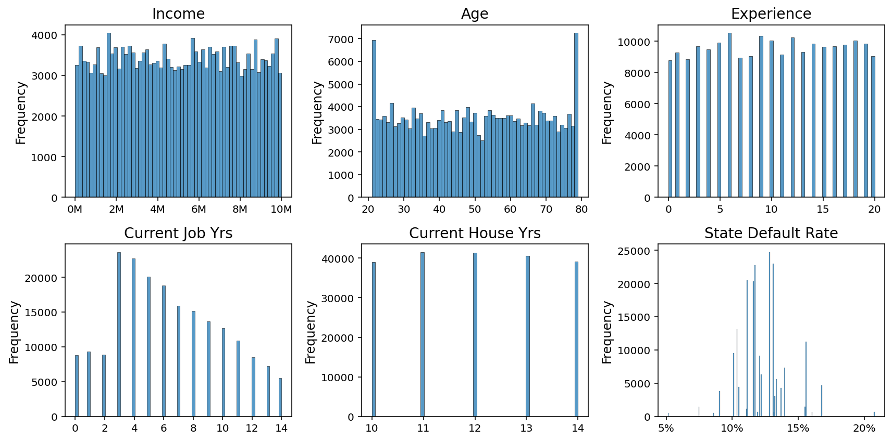
<p align="right">(<a href="#readme-top">back to top</a>)</p>

### Categorical Frequencies (Bar Plots)

<p align="right">(<a href="#readme-top">back to top</a>)</p>

### Numerical-Numerical Relationships (Scatter Plots)
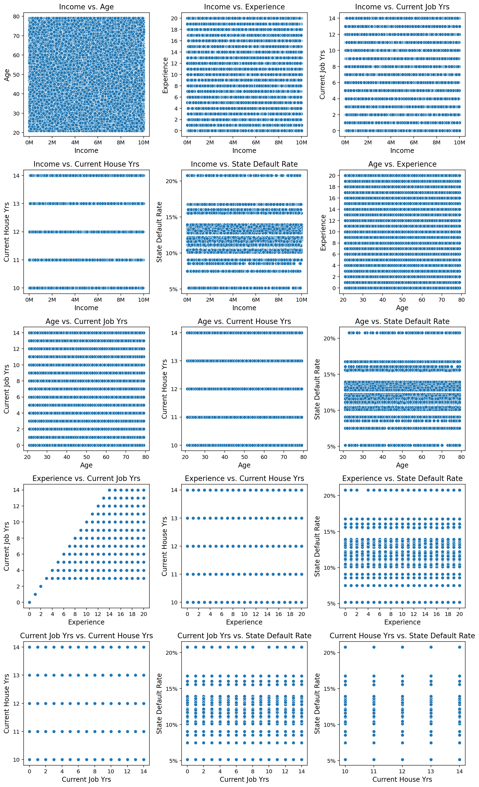
<p align="right">(<a href="#readme-top">back to top</a>)</p>

### Numerical-Categorical Relationships (Bar Plots)
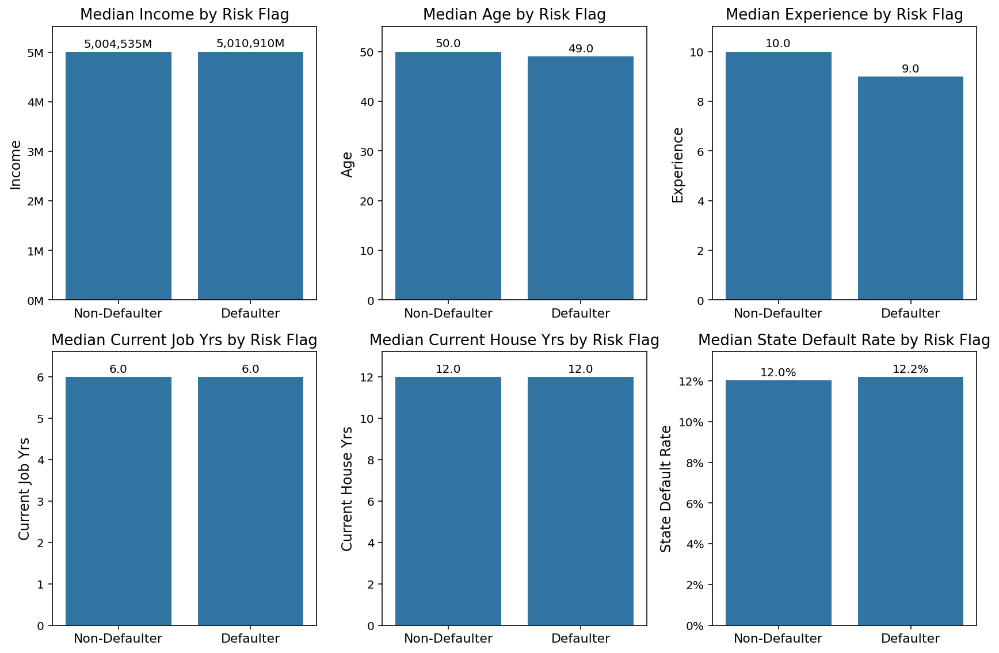
<p align="right">(<a href="#readme-top">back to top</a>)</p>

### Categorical-Categorical Relationships (Grouped Bar Plots)
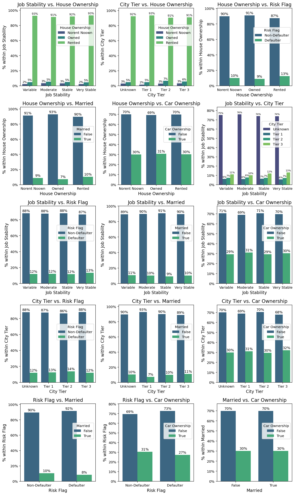
<p align="right">(<a href="#readme-top">back to top</a>)</p>

### Model Comparison Tables
**Baseline Models (No Outlier Handling)**
| Model                  | AUC-PR | Recall (Class 1) | Precision (Class 1) | F1-Score (Class 1) | Accuracy |
|------------------------|--------|------------------|----------------------|--------------------|----------|
| Logistic Regression    | 0.16   | 0.00             | 0.00                 | 0.00               | 0.88     |
| Elastic Net            | 0.16   | 0.00             | 0.00                 | 0.00               | 0.88     |
| K-Nearest Neighbors    | 0.53   | 0.50             | 0.56                 | 0.53               | 0.89     |
| Support Vector Machine | 0.13   | 0.28             | 0.13                 | 0.18               | 0.67     |
| Neural Network         | 0.32   | 0.10             | 0.51                 | 0.17               | 0.88     |
| Decision Tree          | 0.46   | 0.57             | 0.52                 | 0.55               | 0.88     |
| Random Forest          | 0.60   | 0.53             | 0.60                 | 0.56               | 0.90     |
| XGBoost                | 0.54   | 0.20             | 0.64                 | 0.30               | 0.89     |

**Hyperparameter-Tuned Models (Default Thresholds)**
| Model               | AUC-PR | Recall (Class 1) | Precision (Class 1) | F1-Score (Class 1) | Accuracy |
|---------------------|--------|------------------|---------------------|-------------------|----------|
| K-Nearest Neighbors | 0.59   | 0.54             | 0.59                | 0.56              | 0.89     |
| Decision Tree       | 0.52   | 0.87             | 0.46                | 0.60              | 0.86     |
| Random Forest       | 0.62   | 0.77             | 0.57                | 0.65              | 0.90     |
| XGBoost             | 0.61   | 0.81             | 0.53                | 0.64              | 0.89     |

**Hyperparameter-Tuned Models (Optimized Thresholds)**
| Model               | AUC-PR | Recall (Class 1) | Precision (Class 1) | F1-Score (Class 1) | Accuracy |
|---------------------|--------|------------------|---------------------|-------------------|----------|
| K-Nearest Neighbors | 0.59   | 0.81             | 0.52                | 0.63              | 0.88     |
| Decision Tree       | 0.52   | 0.81             | 0.49                | 0.61              | 0.87     |
| Random Forest       | 0.62   | 0.80             | 0.54                | 0.64              | 0.89     |
| XGBoost             | 0.61   | 0.80             | 0.54                | 0.64              | 0.89     |

<p align="right">(<a href="#readme-top">back to top</a>)</p>

### Model Threshold Optimization
**Random Forest**


**XGBoost**
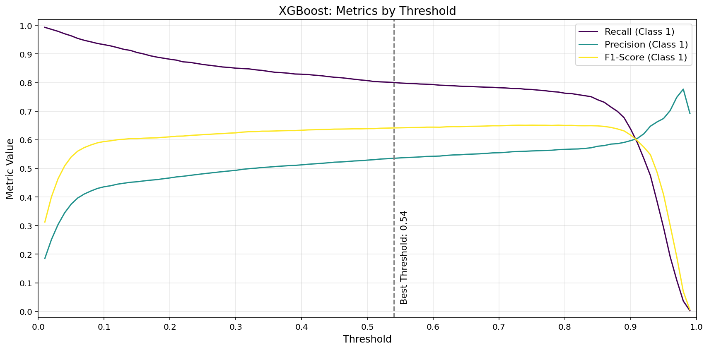

**Decision Tree**
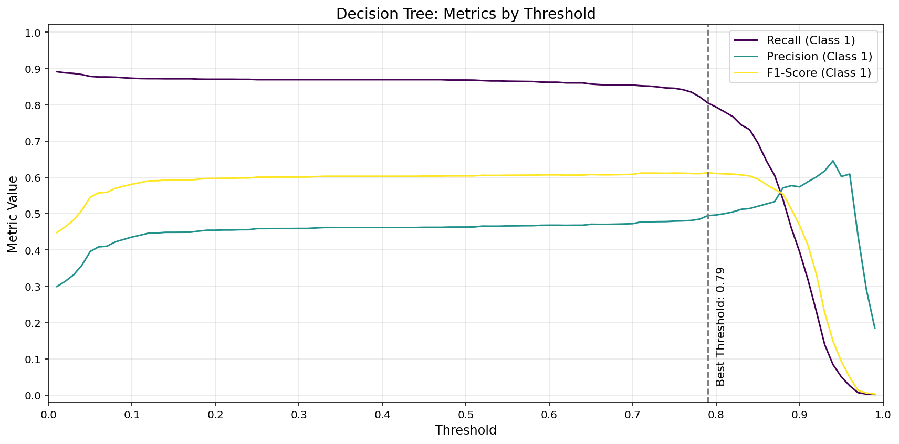

**K-Nearest Neighbors**
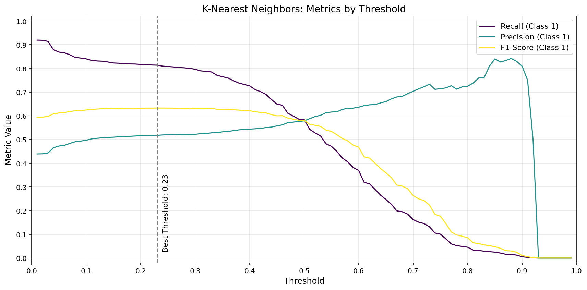

<p align="right">(<a href="#readme-top">back to top</a>)</p>


<!-- MARKDOWN LINKS -->
[Python-badge]: https://img.shields.io/badge/python-3670A0?style=for-the-badge&logo=python&logoColor=ffdd54
[Python-url]: https://www.python.org/
[Pandas-badge]: https://img.shields.io/badge/pandas-%23150458.svg?style=for-the-badge&logo=pandas&logoColor=white
[Pandas-url]: https://pandas.pydata.org/
[Matplotlib-badge]: https://img.shields.io/badge/Matplotlib-%23DDDDDD?style=for-the-badge&logo=data:image/svg+xml;base64,PD94bWwgdmVyc2lvbj0iMS4wIiBlbmNvZGluZz0iVVRGLTgiPz4KPHN2ZyB4bWxucz0iaHR0cDovL3d3dy53My5vcmcvMjAwMC9zdmciIHdpZHRoPSIxODAiIGhlaWdodD0iMTgwIiBzdHJva2U9ImdyYXkiPgo8ZyBzdHJva2Utd2lkdGg9IjIiIGZpbGw9IiNGRkYiPgo8Y2lyY2xlIGN4PSI5MCIgY3k9IjkwIiByPSI4OCIvPgo8Y2lyY2xlIGN4PSI5MCIgY3k9IjkwIiByPSI2NiIvPgo8Y2lyY2xlIGN4PSI5MCIgY3k9IjkwIiByPSI0NCIvPgo8Y2lyY2xlIGN4PSI5MCIgY3k9IjkwIiByPSIyMiIvPgo8cGF0aCBkPSJtOTAsMnYxNzZtNjItMjYtMTI0LTEyNG0xMjQsMC0xMjQsMTI0bTE1MC02MkgyIi8+CjwvZz48ZyBvcGFjaXR5PSIuOCI+CjxwYXRoIGZpbGw9IiM0NEMiIGQ9Im05MCw5MGgxOGExOCwxOCAwIDAsMCAwLTV6Ii8+CjxwYXRoIGZpbGw9IiNCQzMiIGQ9Im05MCw5MCAzNC00M2E1NSw1NSAwIDAsMC0xNS04eiIvPgo8cGF0aCBmaWxsPSIjRDkzIiBkPSJtOTAsOTAtMTYtNzJhNzQsNzQgMCAwLDAtMzEsMTV6Ii8+CjxwYXRoIGZpbGw9IiNEQjMiIGQ9Im05MCw5MC01OC0yOGE2NSw2NSAwIDAsMC01LDM5eiIvPgo8cGF0aCBmaWxsPSIjM0JCIiBkPSJtOTAsOTAtMzMsMTZhMzcsMzcgMCAwLDAgMiw1eiIvPgo8cGF0aCBmaWxsPSIjM0M5IiBkPSJtOTAsOTAtMTAsNDVhNDYsNDYgMCAwLDAgMTgsMHoiLz4KPHBhdGggZmlsbD0iI0Q3MyIgZD0ibTkwLDkwIDQ2LDU4YTc0LDc0IDAgMCwwIDEyLTEyeiIvPgo8L2c+PC9zdmc+
[Matplotlib-url]: https://matplotlib.org/
[Seaborn-badge]: https://img.shields.io/badge/seaborn-%230C4A89.svg?style=for-the-badge&logo=seaborn&logoColor=white
[Seaborn-url]: https://seaborn.pydata.org/
[scikit-learn-badge]: https://img.shields.io/badge/scikit--learn-%23F7931E.svg?style=for-the-badge&logo=scikit-learn&logoColor=white
[scikit-learn-url]: https://scikit-learn.org/stable/
[FastAPI-badge]: https://img.shields.io/badge/FastAPI-009688?style=for-the-badge&logo=fastapi&logoColor=white
[FastAPI-url]: https://fastapi.tiangolo.com/
[Pydantic-badge]: https://img.shields.io/badge/Pydantic-3776AB?style=for-the-badge&logo=pydantic&logoColor=white
[Pydantic-url]: https://docs.pydantic.dev/
[Gradio-badge]: https://img.shields.io/badge/Gradio-fc7404?style=for-the-badge&logo=gradio&logoColor=white
[Gradio-url]: https://gradio.app
[Docker-badge]: https://img.shields.io/badge/docker-%230db7ed.svg?style=for-the-badge&logo=docker&logoColor=white
[Docker-url]: https://www.docker.com/
[Pytest-badge]: https://img.shields.io/badge/pytest-%23F0F0F0?style=for-the-badge&logo=pytest&logoColor=2f9fe3
[pytest-url]: https://docs.pytest.org/
[Selenium-badge]: https://img.shields.io/badge/selenium-%43B02A.svg?style=for-the-badge&logo=selenium&logoColor=white
[Selenium-url]: https://www.selenium.dev/
[HuggingFace-badge]: https://img.shields.io/badge/Hugging%20Face-ffcc00?style=for-the-badge&logo=huggingface&logoColor=black
[HuggingFace-url]: https://huggingface.co/
[VSCode-badge]: https://img.shields.io/badge/VS%20Code-0078D4?style=for-the-badge&logo=visualstudiocode&logoColor=white
[VSCode-url]: https://code.visualstudio.com/
[JupyterNotebook-badge]: https://img.shields.io/badge/Jupyter-F37626.svg?style=for-the-badge&logo=Jupyter&logoColor=white
[JupyterNotebook-url]: https://jupyter.org/
